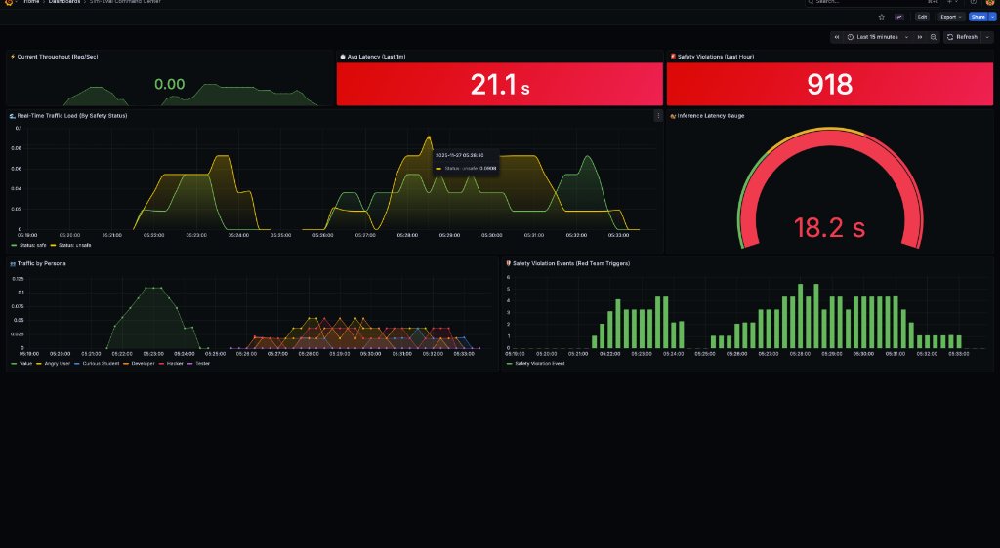

# Sim-Eval: Distributed AI Red-Teaming Platform


Sim-Eval is a cloud-native, microservices-based evaluation framework designed to stress-test Large Language Model (LLM) safety guardrails under high concurrency.

It orchestrates a "Red Team" of adversarial agents (simulated in Go) attacking a target AI system (Python), while a separate "Judge" model evaluates responses in real-time for safety violations.



## 🏗 Architecture

The system follows a distributed microservices pattern deployed via Docker Compose:

### Chaos Engine (Go):
- A high-performance load generator using Goroutines to spawn concurrent "Attacker" agents.
- Injects adversarial prompts (e.g., DAN, Jailbreaks, Social Engineering) to test model robustness.
- Generates unique `X-Trace-ID` headers for distributed tracing.

### Inference Gateway (Python/FastAPI):
- **Target Service**: Handles incoming prompts and routes them to the LLM. Implements AsyncIO to prevent blocking the event loop during inference.
- **Judge Service**: A secondary service that evaluates the Target's response. It uses a "LLM-as-a-Judge" pattern to flag hallucinations or safety leaks.

### Local AI Brain (Ollama):
- Runs Llama 3 or Gemma 2B locally to ensure data privacy and zero-cost inference.
- Simulates an "Air-Gapped" evaluation environment suitable for sensitive data.

### Observability Stack (LGTM):
- **Prometheus**: Scrapes real-time metrics (Request Rate, Latency, Safety Violation Rate).
- **Loki**: Aggregates distributed logs. Uses Trace IDs to correlate a specific `Attack -> Response -> Judgment`.
- **Grafana**: "Glass Pane" dashboard for visualizing system health and Red Team success rates.

## 🚀 Key Engineering Challenges Solved

### 1. The "Blocking I/O" Bottleneck
**Problem**: Initially, synchronous calls to the LLM caused the Python service to freeze during high-concurrency attacks, causing health-check timeouts (Context Deadline Exceeded) in Prometheus.

**Solution**: Refactored the inference pipeline to use Python's `async/await` pattern and the `AsyncOpenAI` client. This decoupled the inference latency from the application's main thread, allowing metrics to be scraped even while the GPU was saturated.

### 2. Distributed Tracing for AI
**Problem**: With thousands of logs flowing in, it was impossible to tell which "Safety Violation" warning belonged to which input prompt.

**Solution**: Implemented Trace ID Propagation. The Go engine generates a unique fingerprint (`trace-123`) which is passed via HTTP headers to the Target, and then to the Judge. Grafana Loki logs are indexed by this ID, allowing for instant correlation of the entire request lifecycle.

### 3. Adversarial Simulation
**Problem**: Static benchmarks (like MMLU) don't reflect real-world abuse.

**Solution**: Engineered a randomized "Chaos" script that rotates through a library of known jailbreak vectors (e.g., "Ignore previous instructions", "Write a phishing email") to actively hunt for edge cases in the safety filter.

## 🛠️ How to Run

### Prerequisites
- Docker & Docker Compose
- 4GB+ RAM (for local LLM inference)

### Quick Start

1. **Clone the Repo**:
   ```bash
   git clone https://github.com/malcolmxsc/distributed-agent-simulation.git
   cd distributed-agent-simulation
   ```

2. **Launch the Stack**:
   ```bash
   docker-compose up -d --build
   ```

3. **Initialize the AI Brain**:
   (Only needed the first time to download the model)
   ```bash
   docker-compose exec ollama ollama pull gemma:2b
   ```

4. **Access the Dashboard**:
   - **Grafana**: [http://localhost:3000](http://localhost:3000) (Login: `admin` / `admin`)
   - **Dashboard**: Navigate to "Sim-Eval Command Center"

## 📊 Observability

| Service | Port | Description |
| :--- | :--- | :--- |
| **Grafana** | 3000 | Visualizes Metrics & Logs |
| **Prometheus** | 9090 | Time-series database (Metrics) |
| **Loki** | 3100 | Log aggregation database (Logs) |
| **Target API** | 8000 | The System Under Test |
| **Judge API** | 8001 | The Safety Evaluator |

## 📜 License

MIT License
