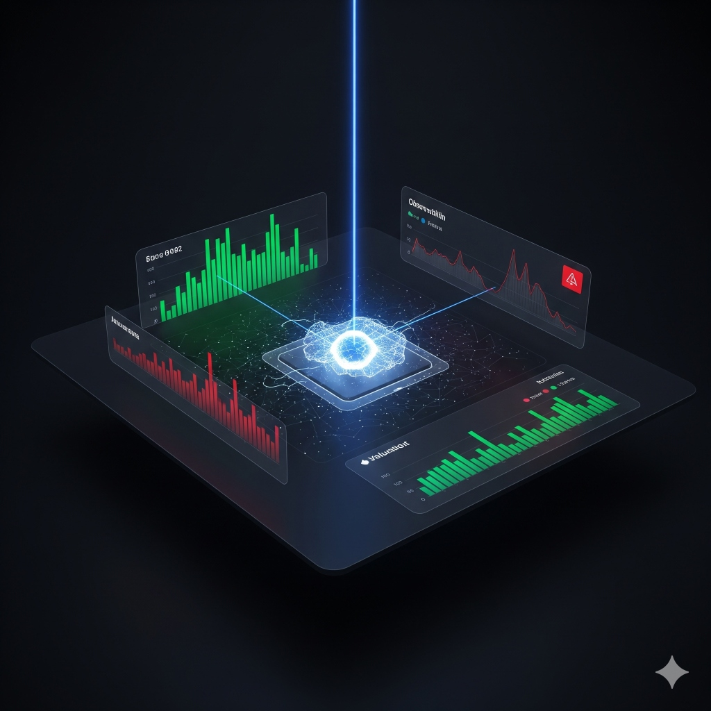

# Sim-Eval: Distributed AI Red-Teaming Platform




**Sim-Eval** is a cloud-native, microservices-based evaluation framework designed to stress-test Large Language Model (LLM) safety guardrails under high concurrency. It treats **AI Safety as Infrastructure**, providing real-time observability into how models behave under adversarial attack.

---


## 🎥 System Demo

| **Mission Control** | **Forensic Tracing** | **Adversarial Engine** |
| :---: | :---: | :---: |
| <video src="https://github.com/user-attachments/assets/3b879237-7765-4943-a635-a4907af1e473" width="100%" controls></video> | <video src="https://github.com/user-attachments/assets/174580cb-b3f1-4964-b35f-03d1616ad84e" width="100%" controls></video> | <video src="https://github.com/user-attachments/assets/ffcb97ea-1643-40f1-9d45-394bff3a193b" width="100%" controls></video> |
| **Real-time Observability**<br>Visualizes high-concurrency traffic (Green) vs. safety violation spikes (Red). Monitors inference latency to ensure non-blocking performance. | **End-to-End Tracing**<br>Correlates specific adversarial prompts with their safety verdicts across microservices using unique `X-Trace-ID` injection in Grafana Loki. | **Chaos Engine**<br>High-performance Go-based load generator using Goroutines to inject randomized jailbreak vectors (DAN, Social Engineering) at scale. |

---

## 🏗 Architecture

The system follows a distributed microservices pattern deployed via Docker Compose:

1.  **Chaos Engine (Go)**: A high-performance load generator that spawns concurrent "Attacker" agents to inject adversarial prompts.
2.  **Inference Gateway (Python/FastAPI)**:
    *   **Target Service**: Handles incoming prompts and routes them to the LLM.
    *   **Judge Service**: Evaluates the Target's response using a "LLM-as-a-Judge" pattern.
3.  **Local AI Brain (Ollama)**: Runs Llama 3 or Gemma 2B locally to ensure data privacy and zero-cost inference.
4.  **Observability Stack (LGTM)**:
    *   **Prometheus**: Scrapes real-time metrics (Request Rate, Latency, Safety Violation Rate).
    *   **Loki**: Aggregates distributed logs indexed by Trace IDs.
    *   **Grafana**: "Glass Pane" dashboard for visualizing system health.

## 🚀 Key Engineering Wins

### 1. Solving "Blocking I/O" with AsyncIO
**Problem**: Synchronous calls to the LLM caused the Python service to freeze during high-concurrency attacks, leading to health-check timeouts.
**Solution**: Refactored the inference pipeline to use Python's `async/await` pattern and the `AsyncOpenAI` client. This decoupled inference latency from the application's main thread, allowing metrics to be scraped even while the GPU was saturated.

### 2. Distributed Context Propagation
**Problem**: With thousands of logs flowing in, it was impossible to tell which "Safety Violation" warning belonged to which input prompt.
**Solution**: Implemented Trace ID Propagation. The Go engine generates a unique fingerprint (`trace-123`) which is passed via HTTP headers to the Target and Judge. Grafana Loki logs are indexed by this ID, allowing for instant correlation of the entire request lifecycle (`Attack -> Response -> Judgment`).

## 🛠️ How to Run

### Prerequisites
- Docker & Docker Compose
- 4GB+ RAM (for local LLM inference)

### Quick Start

1.  **Clone the Repo**:
    ```bash
    git clone https://github.com/malcolmxsc/distributed-agent-simulation.git
    cd distributed-agent-simulation
    ```

2.  **Launch the Stack**:
    ```bash
    docker-compose up -d --build
    ```

3.  **Initialize the AI Brain**:
    (Only needed the first time to download the model)
    ```bash
    docker-compose exec ollama ollama pull gemma:2b
    ```

4.  **Access the Dashboard**:
    - **Grafana**: [http://localhost:3000](http://localhost:3000) (Login: `admin` / `admin`)
    - **Dashboard**: Navigate to "Sim-Eval Command Center"

---

## 📜 License

MIT License
